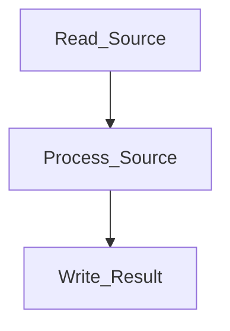

# Dev Assignment

This project Implement a Windows console application that can process an input text file and create an output file containing the list of all words in the input file and their frequencies.

## Table of Contents

1. [Project Structure](#project-structure)
2. [Architecture](#architecture)
	- [Overview](#overview)
	- [Modularity Design](#modularity-design)
		- [Separation of Concerns](#separation-of-concerns)
		- [Interfaces](#interfaces)
		- [Dependency Injection](#dependency-injection)
	- [Scalability](#scalability)
		- [Efficient Algorithms](#efficient-algorithms)
		- [Memory Management](#memory-management)
		- [Concurrency](#concurrency)
		- [Modularity](#modularity)
	- [Error Handling](#error-handling)
3. [Testing and Maintenance](#testing-and-maintenance)
4. [Performance](#performance)
	- [System Information](#system-information)
	- [Unit Tests](#unit-tests)
		- [Test 10 lines file](#test-10-lines-file)
		- [Test 1_000_000 lines file](#test-1_000_000-lines-file)
		- [Test 5_000_000 lines file](#test-5_000_000-lines-file)
	- [Test Large File](#test-large-file)
5. [Appendix](#appendix)

## Project Structure
```
Project
├───.github
│   └───workflows         (CI/CD)
├───DevAssignment         (Main project)
└───DevAssignment.Tests   (Unit tests)
```

1. CI/CD (.github/workflows): This directory contains the configuration for continuous integration and continuous deployment (CI/CD) workflows. It ensures that the project is automatically built and tested whenever changes are made, facilitating a smooth development process.

2. Main Project (DevAssignment): This directory contains the core logic of the application. It is the primary module where the main functionality, such as reading the input file, processing the words, and writing the output file, is implemented.

3. Unit Tests (DevAssignment.Tests): This directory contains unit tests for the main project. By separating tests from the main project, it ensures that testing can be done independently, and new tests can be added without affecting the core logic.


## Architecture

### Overview

The project follows a modular architecture that separates different concerns into distinct components. The main components of the project are:



### Modularity Design

Modularity is a key design principle in the project, allowing for the separation of concerns and the creation of reusable components. The project is divided into three main components: Reader, Processor, and Writer. Each component is responsible for a specific task.

#### Separation of Concerns

The project follows the principle of separation of concerns, where different functionalities are divided into separate classes or methods. For example, file reading, word processing, and file writing are implemented in different classes or methods. This makes the code easier to understand, maintain, and extend. If an existing component needs to be updated or optimized, it can be done independently without affecting other parts of the project. For example, if a more efficient word counting algorithm is discovered, it can be implemented and tested separately before being integrated.

#### Interfaces

Using interfaces allows for flexible and interchangeable components. The project uses interfaces for source reading, data processing, result writing. With such design, different implementations (e.g., reading from a local file, a network source, or a database, writing to a local file or a database) can be added without changing the core logic. The modular design also allows for new features to be added with minimal impact on existing code. For example, if a new feature to process different file formats (e.g., CSV, JSON) is required, it can be implemented as a new module and integrated into the existing workflow.

#### Dependency Injection

By using dependency injection, the project can manage dependencies more effectively. This allows for easier testing and swapping of components. For example, a different word processing algorithm can be injected without modifying the existing code.


### Scalability 

The project is designed to be scalable, allowing it to handle large files efficiently.

#### Efficient Algorithms

The project uses efficient algorithms to process the input text file and calculate word frequencies. This ensures that the application can handle larger files without a significant increase in processing time. For example, reading the file line by line instead of loading the entire file into memory helps manage memory usage effectively.

```csharp
// Read the file line by line and use yield return to return each line
using (StreamReader reader = new StreamReader(_filePath))
{
    string line;
    while ((line = reader.ReadLine()) != null)
    {
        yield return line;
    }
}
```

#### Memory Management

By processing the file line by line, the application avoids loading the entire file into memory, which is crucial for handling large files. This approach ensures that the application can scale to handle very large files without running out of memory.

#### Concurrency

The application is designed to support parallel processing, it can take advantage of multiple CPU cores to process different parts of the file simultaneously, thereby reducing the overall processing time. This can be particularly useful for very large files.

```csharp
// Use LINQ to read and count the words in parallel
_reader.ReadLines().AsParallel().ForAll(line =>
{
    // Find all the words in the line
    foreach (Match match in wordPattern.Matches(line))
    {
        // Add the word to the dictionary, incrementing the count if it already exists
        wordFrequencies.AddOrUpdate(match.Value.ToLower(), 1, (key, oldValue) => oldValue + 1);
    }
});
```

#### Modularity

The project structure is modular, which allows for easy updates and enhancements. For example, if a more efficient algorithm is discovered, it can be integrated into the project without significant changes to the overall structure. This modularity also allows for the addition of new features without affecting existing functionality.

### Error Handling

The project includes error handling mechanisms to ensure that exceptions are caught and handled appropriately. This helps prevent the application from crashing and provides feedback to the user in case of errors. For example, if the input file is not found or cannot be read, the application will display an error message to the user. This ensures a better user experience and helps identify and resolve issues quickly.

Some exceptions are extended to provide more information about the error. For example, `NotSupportedFormatExeption` is extended from `Exception` to provide more information about the error when reading or writing the file. 

## Testing and Maintenance

The separation of unit tests from the main project ensures that testing can be done independently. New tests can be added for new features or updates, ensuring that the project remains robust and maintainable.

### Unit Tests

The project includes unit tests to validate the functionality of the main components. These tests cover various scenarios, such as processing files with different sizes, formats, and contents. By running these tests regularly, the project can ensure that new changes do not introduce regressions or bugs. The unit tests are designed to be repeatable, automated, and isolated. This ensures that the tests can be run independently of each other and in any order. The tests are also designed to be self-contained, meaning they do not rely on external dependencies or state.

There are 3 main components are tested unit tests:

- FileResultWriterTests: Test reading from a file with different sizes and formats.
- WordFrequencyProcessorTests: Test processing the words from the input file.
- FileSourceReaderTests: Test writing the output file with the correct word frequencies.

## Performance

### System Information

Computer specifications (Some information are removed):
```
$ systeminfo
OS Name:                   Microsoft Windows 11 Pro
OS Version:                10.0.22631 N/A Build 22631
System Model:              Zenbook UX3402VA_UX3402VA
System Type:               x64-based PC
Processor(s):              1 Processor(s) Installed.
                           [01]: Intel64 Family 6 Model 186 Stepping 2 GenuineIntel ~2200 Mhz
Total Physical Memory:     16,003 MB
```

### Unit Tests

During the development, the project has been tested using unit tests and measure the performance of when invoking the test method for processing file.

In the provided performance tests, the application demonstrates its ability to handle files of varying sizes efficiently. For instance:
- A file with 1,000,000 lines (35 MB) is processed in approximately 5.3 seconds.
- A file with 5,000,000 lines (175 MB) is processed in approximately 45.9 seconds.
- A file with 38,918,880 lines (1.26 GB) is processed in approximately 3 minutes and 32 seconds.

#### Test 10 lines file

```txt
File size: 350 bytes
Time taken: 113 ms
Memory used: 67552 bytes
```

#### Test 1_000_000 lines file
```txt
File size: 35000000 bytes
Time taken: 5298 ms
Memory used: 275496 bytes
```

#### Test 5_000_000 lines file
```txt
File size: 175000000 bytes
Time taken: 45869 ms
Memory used: 276064 bytes
```

### Test Large File

This test is using `Measure-Command` to measure the execution time of the application with a large file.

The test file size is 1.26 GB (1,362,160,800 bytes) and contain 38918880 lines of sentence. In this test, the application took 3 minutes and 32 seconds to process the file.

```powershell
$ Measure-Command { .\DevAssignment\bin\Debug\DevAssignment.exe .\test_large_file.txt output.txt }

Days              : 0
Hours             : 0
Minutes           : 3
Seconds           : 32
Milliseconds      : 534
Ticks             : 2125347102
TotalDays         : 0.00245989247916667
TotalHours        : 0.0590374195
TotalMinutes      : 3.54224517
TotalSeconds      : 212.5347102
TotalMilliseconds : 212534.7102
```

## Appendix

Script `wc.py` to count the number of lines in a large text file and its size.
```python
import os


def count_lines(file_path):
    try:
        with open(file_path, 'r', encoding='utf-8') as file:
            return sum(1 for line in file)
    except UnicodeDecodeError:
        with open(file_path, 'r', encoding='latin-1') as file:
            return sum(1 for line in file)

def get_file_size(file_path):
    return os.path.getsize(file_path)

if __name__ == "__main__":
    file_path = 'test_large_file.txt'
    line_count = count_lines(file_path)
    file_size = get_file_size(file_path)
    print(f'The file has {line_count} lines and is {file_size} bytes in size.')
```